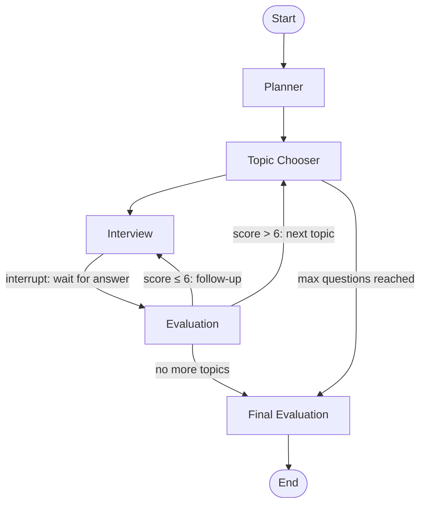

# AI Interview Coach

An AI-powered mock technical interviewer that reads your resume and a job description, then runs a personalized, adaptive Q&A session. Built with **LangGraph** and **Mistral AI**, with a **Streamlit** web UI for an interactive experience.

Paste your resume (or upload a PDF), add the target job description, and answer questions tailored to your background. Difficulty adjusts in real time based on your performance, and you get a detailed hiring-style report at the end — even if you stop early.

---

## Features

- **Resume-aware questions** — Topics and prompts reference your actual projects, tech stack, and experience
- **JD gap analysis** — Compares your resume against the job description to surface strengths and missing skills
- **Adaptive difficulty** — Scores of 7+ increase difficulty; scores of 5 or below decrease it (scale 1–5)
- **Smart topic routing** — Prioritizes missing skills, then resume projects, strengths, system design, and CS fundamentals
- **Follow-up probing** — Weak answers trigger deeper follow-up questions on the same topic
- **Per-answer scoring** — Immediate feedback with scores across technical correctness, depth, and communication
- **Final assessment report** — Overall score, hiring recommendation, strengths/weaknesses, and a learning roadmap
- **Early exit** — End the interview anytime and receive a report based on answers collected so far
- **PDF resume support** — Upload a PDF or paste resume text directly

---

## Architecture

The interview flow is modeled as a **LangGraph** state machine with checkpointing for resumable, interrupt-driven Q&A:



| Node | Role |
|------|------|
| **Planner** | Parses resume + JD; extracts strengths, missing skills, and resume projects |
| **Topic Chooser** | Picks the next interview topic based on priority and coverage |
| **Interview** | Generates a contextual question and pauses for the candidate's answer |
| **Evaluation** | Scores the answer, adjusts difficulty, and routes to follow-up or next topic |
| **Final Evaluation** | Produces the full assessment report |

---

## Project Structure

```
AI-Interview-Coach/
├── interview_agent.py   # LangGraph workflow, nodes, and compiled app
├── streamlit_app.py     # Streamlit web UI
├── PdfLoader.py         # PDF resume text extraction
├── requirement.txt      # Python dependencies
├── .env                 # API keys (create locally — not committed)
└── .gitignore
```

---

## Prerequisites

- Python 3.10+
- A [Mistral AI](https://mistral.ai/) API key

---

## Installation

1. **Clone the repository**

   ```bash
   git clone https://github.com/Akhil-1802/AI-Interview-Coach.git
   cd AI-Interview-Coach
   ```

2. **Create and activate a virtual environment** (recommended)

   ```bash
   python -m venv .venv
   source .venv/bin/activate   # Linux / macOS
   # .venv\Scripts\activate    # Windows
   ```

3. **Install dependencies**

   ```bash
   pip install -r requirement.txt
   ```

4. **Configure environment variables**

   Create a `.env` file in the project root:

   ```env
   MISTRAL_API_KEY=your_mistral_api_key_here
   ```

---

## Usage

Start the Streamlit app:

```bash
streamlit run streamlit_app.py
```

Then in the sidebar:

1. Paste your resume or upload a PDF
2. Paste the job description
3. Click **Start Interview**
4. Answer each question and submit
5. Review your final report, or click **End Interview Now** to generate a report from partial progress

---

## How It Works

### Topic priority

Questions are drawn in this order until all topics are covered or the session limit (~10 questions) is reached:

1. Skills in the JD but missing from the resume
2. Projects listed on the resume
3. Matched strengths (skills in both resume and JD)
4. System design topics (distributed systems, scalability, API design, etc.)
5. CS fundamentals (data structures, algorithms, OS, networking)

### Difficulty levels

| Level | Question style |
|-------|----------------|
| 1 | Conceptual / definition |
| 2 | Practical use-case |
| 3 | Project-specific implementation |
| 4 | Scenario, tradeoff, or debugging |
| 5 | System design / architecture |

### Scoring & routing

- **Score > 6** → Topic marked covered; move to the next topic
- **Score ≤ 6** → Follow-up question on the same topic
- Difficulty increases after strong answers (≥ 7) and decreases after weak ones (≤ 5)

### Final report

The closing assessment includes:

- Overall score (1–10)
- Hiring recommendation (`Strong Hire`, `Hire`, `No Hire`, `Strong No Hire`)
- Confidence level
- Strengths and weaknesses
- Most impressive and weakest answers
- Recommended learning roadmap
- Detailed final feedback

---

## Tech Stack

| Layer | Technology |
|-------|------------|
| LLM | Mistral AI (`mistral-small-latest`) via LangChain |
| Orchestration | LangGraph (StateGraph, interrupts, MemorySaver) |
| UI | Streamlit |
| PDF parsing | PyPDF via LangChain Community |
| Config | python-dotenv |

---

## Configuration

Key constants in `interview_agent.py`:

| Constant | Default | Description |
|----------|---------|-------------|
| `PASSING_SCORE` | `6` | Minimum score to advance to the next topic |
| `MAX_QUESTIONS` | `10` | Maximum questions per session |
| Model | `mistral-small-latest` | Mistral model used for all LLM calls |
| Temperature | `0.5` | Sampling temperature for generation |

---

## License

This project is open source. Add a license file if you plan to distribute it formally.

---

## Author

**Akhil** — [GitHub](https://github.com/Akhil-1802)
